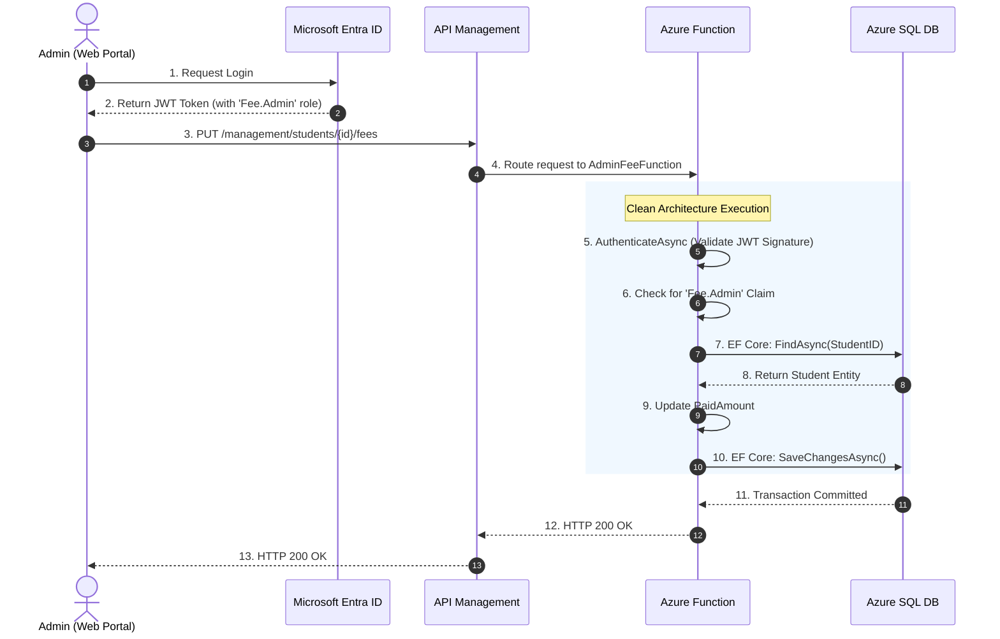
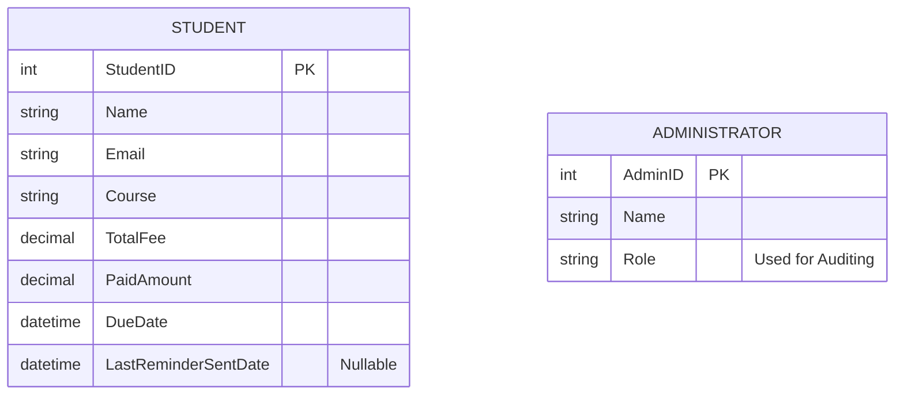

# Solution Architecture: Serverless Fee Management System

**Target Platform:** Microsoft Azure  
**Architecture Pattern:** Clean Architecture / Serverless

---

## 1. Executive Summary

This document outlines the architecture for a highly scalable, cloud-native Student Fee Management System. The solution is designed to handle at least 5,000 student records efficiently, providing secure APIs for both students and administrators, alongside an automated background process for overdue fee notifications.

To maximize scalability and minimize idle compute costs, the system relies entirely on Azure Serverless components (Azure Functions, Azure API Management Consumption Tier, and Azure SQL Serverless/Free Tier).

---

## 2. System Architecture

The system utilizes a 3-layer **Clean Architecture** (Domain, Infrastructure, Functions) to strictly decouple business logic from external dependencies like databases and SMTP relays.

### Key Components:
- **API Gateway:** Azure API Management (APIM)
- **Identity Provider:** Microsoft Entra ID (Azure AD)
- **Compute Layer:** Azure Functions (.NET 8 Isolated Worker)
- **Automation Engine:** Azure Durable Functions
- **Data Layer:** Azure SQL Database
- **Notification Service:** SendGrid SMTP Relay
- **Observability:** Azure Application Insights

---

## 3. Security Model

Security is split deliberately based on the distinct requirements of the actors accessing the system.

### 3.1 Student Flow (API Keys)
- **Requirement:** Provide students access to view their fee status.
- **Implementation:** Exposed securely via Azure API Management. Students authenticate using an `Ocp-Apim-Subscription-Key`. APIM enforces rate-limiting to protect the backend from abuse or DDoS attempts.

### 3.2 Administrator Flow (Azure AD + RBAC)
- **Requirement:** Secure, elevated access to update financial records.
- **Implementation:** Secured by Microsoft Entra ID. 
  1. Administrators authenticate via Entra ID and receive a JWT Bearer token.
  2. The Azure Function cryptographically validates the token signature.
  3. Strict Role-Based Access Control (RBAC) is enforced by checking for the `Fee.Admin` App Role claim before any database operations occur.

#### Admin Update Sequence Flow

---

## 4. Data Architecture

The system uses an Azure SQL Database managed via Entity Framework Core. The schema isolates core domain entities.

### Entity-Relationship (ER) Model

*Note: In this bounded context, Administrators have global access to manage all students, so no associative mapping table is required.*

---

## 5. Automation & Scalability (Durable Functions)

The system automatically emails students with overdue payments daily at 8:00 AM. 

Instead of relying on basic Azure Logic Apps, the system implements **Azure Durable Functions** to handle high-volume scalability entirely in code.
- **Fan-Out/Fan-In Pattern:** The orchestrator fetches all overdue students and spawns parallel asynchronous tasks to process every email simultaneously, effortlessly handling the 5,000+ student requirement.
- **Idempotency:** The `SendReminderActivity` explicitly updates the `LastReminderSentDate` column immediately upon successful dispatch to prevent duplicate emails.

---

## 6. Architectural Trade-Offs & Decisions

1. **Durable Functions vs. Logic Apps**
   - *Decision:* Durable Functions.
   - *Justification:* While Logic Apps are suitable for low-code integrations, Durable Functions allow us to keep complex fan-out automation logic version-controlled in C#. This improves unit-testability and CI/CD deployment pipelines.

2. **SendGrid vs. Outlook Mailbox**
   - *Decision:* SendGrid.
   - *Justification:* SendGrid is an enterprise-grade SMTP relay explicitly built for high-volume automated transactional emails. It is vastly superior to a standard Outlook mailbox (which has strict daily sending limits) for scaling to 5,000+ reminders.

3. **Native Retry Policies vs. Azure Service Bus**
   - *Decision:* Native Durable Task Retry.
   - *Justification:* To handle transient network failures when communicating with SendGrid or Azure SQL, the system utilizes the native `RetryPolicy` built directly into the Durable Task framework (Exponential Backoff). This avoids the infrastructure complexity and cost of deploying and managing a separate Azure Service Bus queue.

4. **Imperative Auth vs. Custom Middleware**
   - *Decision:* Imperative `AuthenticateAsync()`.
   - *Justification:* The .NET 8 Isolated Worker model handles `[Authorize]` attributes differently than traditional ASP.NET Core. To ensure absolute cryptographic validation and explicit control over HTTP 401/403 responses, the JWT validation is handled imperatively at the Function level rather than through custom middleware abstractions.
